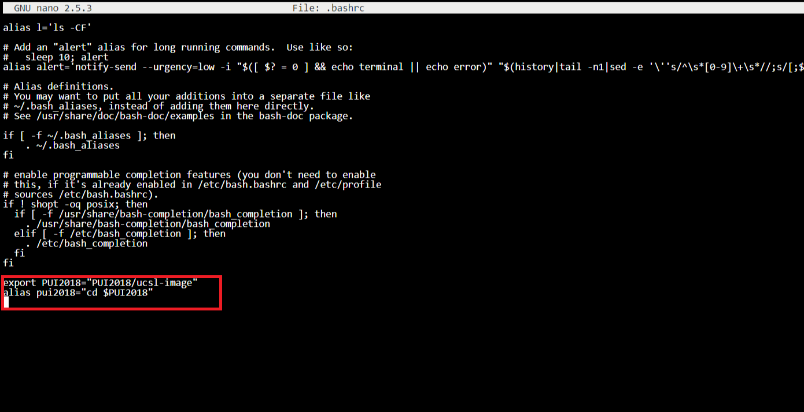

# Homework 1

The environment variable for the PUI directory was added in the .bashrc. An alias was also created to directly go into the directory.

Demonstrated using the environment variable and the alias.

