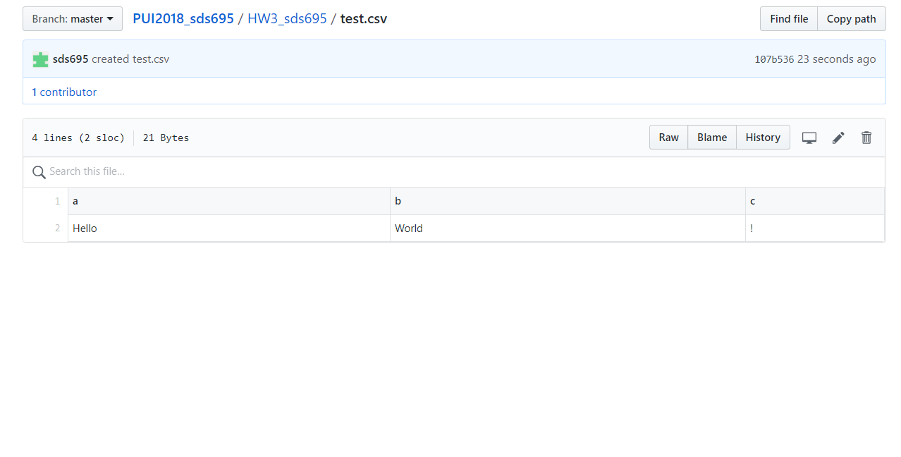
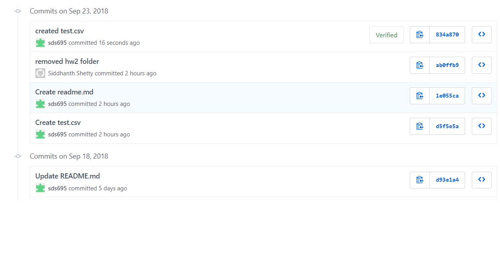
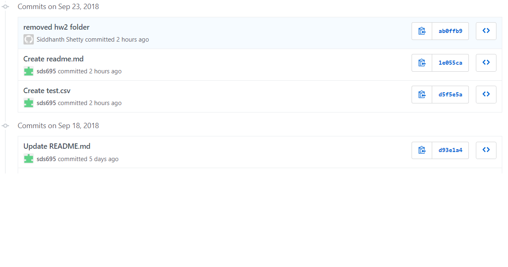

## Assignment 1
This folder contained the file test.csv as shown by the screenshots below.

The current history shows no trace of the file.

## Assignment 2
The jupyter notebook for assignment 2 where I picked the Citywide Payroll Data was uploaded. This assignment had one working with the csv data and the second part with the soda api.

## Assignment 3
The python script show_bus_locations.py has been uploaded. This file needs to be run with the arguments MTA Bus Route key and the Bus line you wish to see and it returns the positions of the active buses(eg. python show_bus_locations.py xxxx-xxxx-xxxx-xxxx-xxxx <BUS_LINE>).

## Assignment 4
The python script get_bus_info.py has been uploaded. This file needs to be run with the arguments MTA Bus Route key, the Bus line and a csv file that you want the data to be stored in(eg. python get_bus_info.py xxxx-xxxx-xxxx-xxxx-xxxx <BUS_LINE> <BUS_LINE>.csv). This file returns the positions of the buses in the route along with the next stop name and how far the bus is from the stop.
