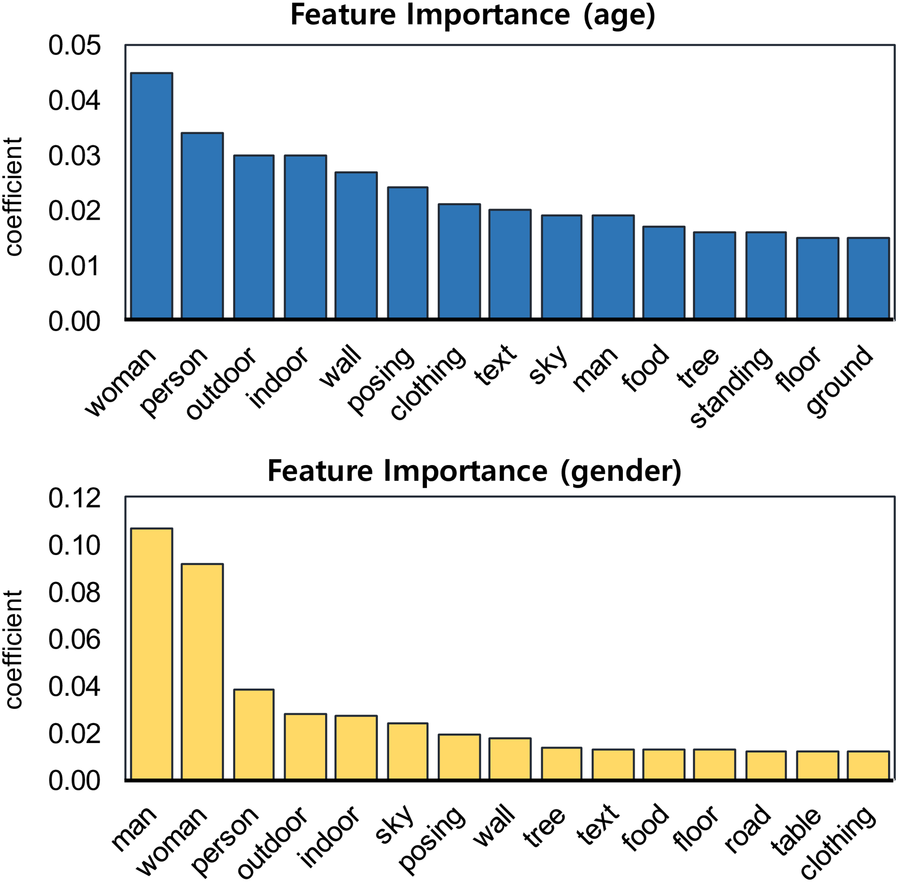
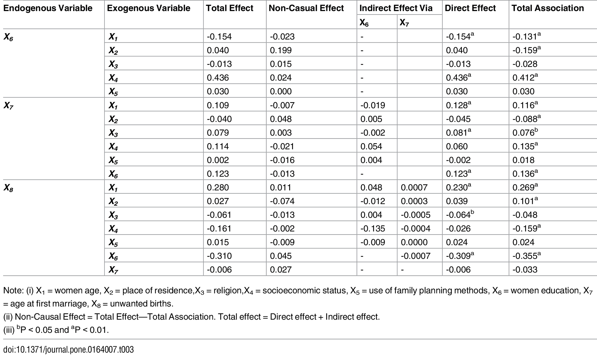
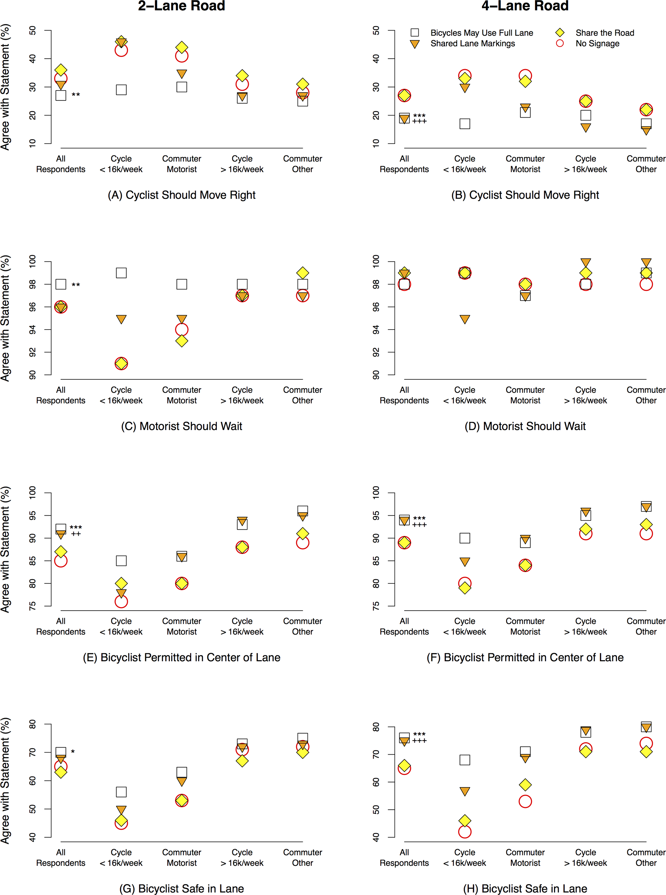

## Assignment 1

Reviewed Saloni Saini(Net ID ss12513, Github handle SaloniSaini02) and submitted pull request for which i got confirmation.

## Assignment 2

I worked with Pranay Anchan(pya209) for this assignment. Pranay did reviewed the paper for the ANOVA test while I reviewed the 
papers for the logistic regression and path analysis.

| Statistical Analysis      | IV(s)                                                                                                                               | IV type(s)        | DV(s)                                                                                 | DV type(s)        | Control Var | Control Var type     | Question to be answered                                                                              | H0                                                                                                                        | alpha             | link to paper                                                                                                         |
|---------------------------|-------------------------------------------------------------------------------------------------------------------------------------|-------------------|---------------------------------------------------------------------------------------|-------------------|-------------|----------------------|------------------------------------------------------------------------------------------------------|---------------------------------------------------------------------------------------------------------------------------|-------------------|-----------------------------------------------------------------------------------------------------------------------|
| ANOVA                     | 2, Age & Gender                                                                                                                     | Categorical       | 1,  Ratio to all topics for all users                                                 | Continuos         | 0           | Not Applicable       | Are the differences in ratios between age and gender groups different ?                              | 1. Ratio(teens) = Ratio(adults)  2. Ratio(male) = Ratio(female)                                                           | 0.05              | [“Is a picture really worth a thousand words?”: A case study on classifying user attributes on Instagram](https://journals.plos.org/plosone/article?id=10.1371/journal.pone.0204938)               |
|    Path analysis          |    5, women age (X1), place of residence (X2),   religion (X3), socioeconomic status (X4), use of family   planning methods (X5)    |    categorical    |    3,  women education (X6), age at first   marriage (X7) and unwanted births (X8)    |    categorical    |    0        |    Not Applicable    |     Which of the independent variables affected number of    unwanted births?                        |     The independent variables do not significantly affect the    number of unwanted births.                               |     0.05,0.01     |     [Correlates    of Unwanted Births in Bangladesh: A Study through Path Analysis](https://journals.plos.org/plosone/article?id=10.1371/journal.pone.0164007)                                     |
|    Logistic Regression    |    1, Type of commuter                                                                                                              |    categorical    |    1, number of agreed to statement                                                   |    discrete       |    0        |    Not Applicable    |      “Bicycles May Use Full Lane” signage was the most    comprehensible traffic control device?     |      “Bicycles May Use Full Lane” signage had equal or significantly    less impact on commuters than other signages.     |     0.01          |     [“Bicycles    May Use Full Lane” Signage Communicates U.S. Roadway Rules and Increases    Perception of Safety](https://journals.plos.org/plosone/article?id=10.1371/journal.pone.0136973)     

### Picture for anova test

### Picture for path analysis

### Picture for logistic regression

## Assignment 3

Included the completed jupyter notebook reproducing the test for the hard to employ prisoners.

## Assignment 4

Included the completed jupyter notebook performing KS test, Pearson's test for correlation and Spearman's test for correlation.
