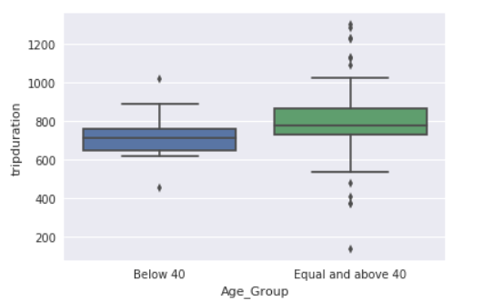

## Assignment 1
I created a box and whisker plot to show the differences between two age groups of city bike riders. I did this using the seaborn library's boxplot function.

## Assignment 2
The t-test was implemented for the previous city bike assignment and an authorea document was created. The link to the document is https://www.authorea.com/users/249353/articles/335413-citibike-do-younger-people-tend-to-ride-longer
